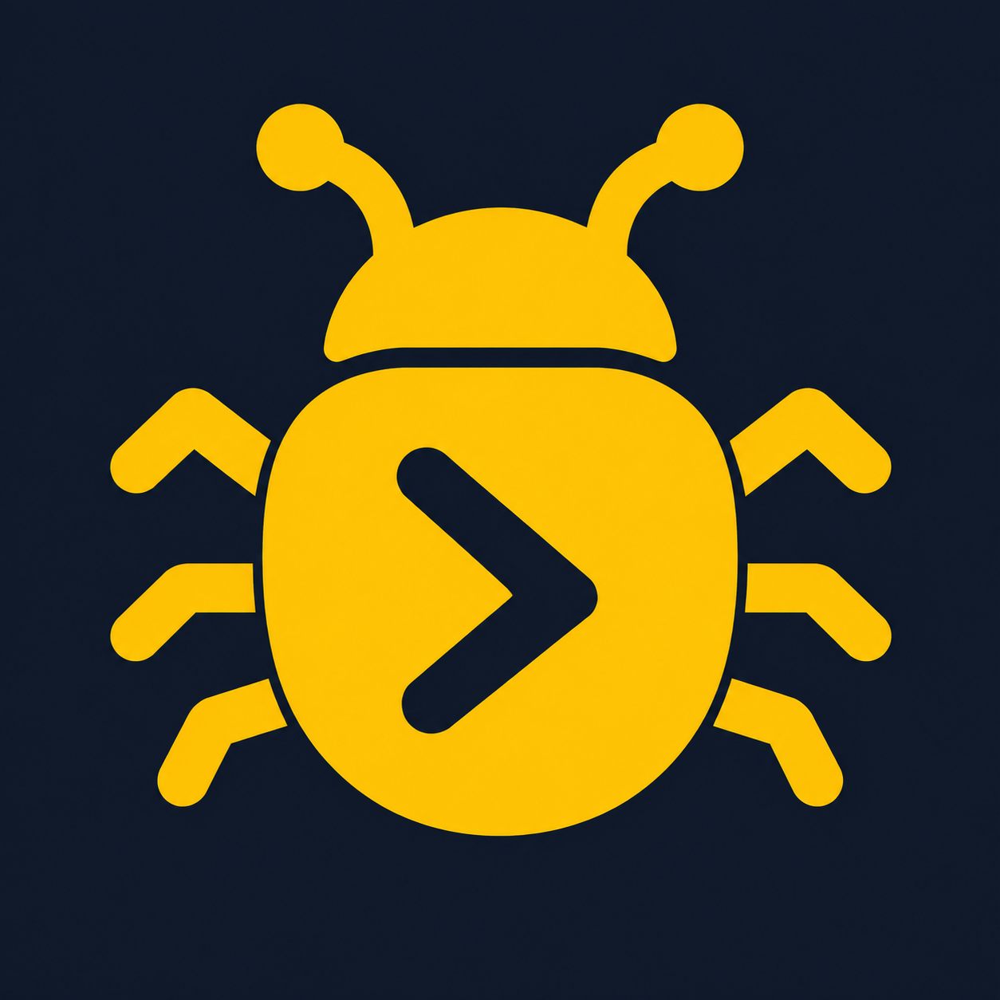

# GDBG Godot addon



Game-agnostic runtime bridge for agent tooling. The addon packages the wire
protocol, state layout, screenshots, input routing, console framework, and
automated test harnesses without depending on a host game's implementation.

## Requirements

- **Godot 4.3 or newer (4.x)** for the supported GDBG workflow. Godot 3.x and Godot
  4.0–4.2 are not supported.
- Tested on **macOS** with **Godot 4.3** and **Godot 4.7.1**.
- The companion `gdbg` CLI is a **separate required install** for agent, shell,
  and CI commands. The addon can be enabled and run in the editor without the
  CLI, but it provides no standalone editor control UI.
- Keep the CLI and addon on the **same release version**; compare `gdbg version`
  with the addon's `plugin.cfg` version.

## Contents

- `plugin.cfg` / `plugin.gd` — editor plugin metadata and autoload registration.
- `debug_bridge_protocol.gd` (`DebugBridgeProtocol`) — IPC file names and command
  content parsing (JSON-object vs. legacy plain-text).
- `debug_bridge_state.gd` (`DebugBridgeState`) — state-root path resolution.
- `debug_bridge_host.gd` (`DebugBridgeHostBase`) — host contract base class.
- `console_bridge_host.gd` (`DebugBridgeConsoleHostBase`) — ready-to-extend
  registry-backed console host.
- `screenshot_manager.gd` — autoload `ScreenshotManager`: capture sizing, directory
  rules, timestamped naming, history pruning.
- `ai_debug_bridge.gd` — autoload `AIDebugBridge`: file IPC loop, screenshot /
  piggyback / fetch orchestration, input injection.
- `testing/` — game-agnostic testing surface:
  - `test_host.gd` (`DebugBridgeTestHostBase`) — host contract base class.
  - `test_runtime.gd` (`DebugBridgeTestRuntime`) — playtest orchestration autoload.
  - `automation_test_suite.gd` (`DebugBridgeAutomationTestSuite`) /
    `automation_playtest_suite.gd` (`DebugBridgePlaytestSuite`) /
    `integration_test_suite.gd` (`DebugBridgeIntegrationTestSuite`) — suite
    harnesses with product-prefixed global names.
  - `test_result.gd` (`DebugBridgeTestResult`) — assertion result + CI report.
  - `playtest_recorder.gd` (`DebugBridgePlaytestRecorder`) — frame recording.
  - `integration_runner.gd` / `integration_runner.tscn` — CLI integration entry.

## Install

### Recommended: install the CLI

1. Install the `gdbg` CLI from
   https://github.com/Dluck-Games/godot-debug-bridge#install-the-cli.
2. Run `gdbg --project-dir /path/to/project addon install`. Source checkouts can
   add `--source /path/to/godot-debug-bridge/addons/gdbg`.
3. The command copies the addon, enables the plugin in `project.godot`, and runs
   a complete headless import. On enable, the plugin registers default settings (state env/app name and the
   playtest suite pattern) and the stable `ScreenshotManager`, `AIDebugBridge`
   and `DebugBridgeTestRuntime` autoloads.
4. To expose project console commands, register `DebugBridgeHost` before
   `AIDebugBridge`. To use integration/playtest tiers, also register a
   `DebugBridgeTestHost` adapter before `DebugBridgeTestRuntime`.

The CLI installer enables the plugin itself, so no manual plugin enablement is
required on this path.

### Manual, Asset Library, or store installation

1. Install or extract `addons/gdbg` directly at the project root so the files
   live at `res://addons/gdbg/` with no extra enclosing folder.
2. Open the project in Godot and wait for the import to finish.
3. Open **Project > Project Settings > Plugins** and enable **Godot Debug
   Bridge**.
4. Verify that the three autoloads are registered: `ScreenshotManager`,
   `AIDebugBridge`, and `DebugBridgeTestRuntime`.
5. Close the editor, then separately install the matching CLI from
   https://github.com/Dluck-Games/godot-debug-bridge#install-the-cli and check
   `gdbg version` against the addon's `plugin.cfg` version.

GitHub Releases and CLI installation are the primary distribution channel.
Asset catalogs are complementary addon discovery and installation routes;
installing the addon through a catalog does not install the CLI.

Disabling the plugin removes the autoloads it owns, and a normal editor
shutdown preserves them, so the addon installation survives restarts.

For a working project with console and test host adapters, see the
[minimal example](https://github.com/Dluck-Games/godot-debug-bridge/blob/main/examples/minimal/README.md).

Console and input IPC work with the CLI's default headless game launch.
Screenshots and recordings need a rendered viewport, so launch with
`gdbg run game --windowed`; headless capture requests return a readable error
instead of touching Godot's dummy renderer.

## Testing surface

The addon owns a game-agnostic automated-testing framework. The host project
extends `DebugBridgeTestHostBase` and registers the subclass as the
`DebugBridgeTestHost` autoload; the addon never imports host or game types and
talks to it only through `Variant`/`Array`/`Dictionary`/`Callable` boundaries.
Required build/load/world methods fail closed with a readable `error`
dictionary when a host is missing or not fully implemented.

| Group | Host method | Purpose |
| --- | --- | --- |
| Fixtures | `build_fixture(kind, data)` | Build an opaque project-defined fixture |
| Scenario | `build_scenario(config)` / `scenario_label(scenario)` | Build and label opaque suite data |
| Integration | `integration_setup` / `integration_load` / `integration_world` / `integration_teardown` / `integration_quit` | Project lifecycle delegation |
| Playtest | `playtest_boot` / `playtest_load` / `playtest_world` / `playtest_run` / `playtest_quit` | Production lifecycle delegation |

GDBG never reads fields from a scenario and never assigns meaning to fixture
kinds or option keys. A game can expose its own convenience methods in a local
suite subclass and implement them through these two generic build methods.

### Suites

- `DebugBridgeAutomationTestSuite` — base suite; owns an opaque `scenario`,
  offers `make_scenario`, `make_fixture`, `_wait_frames` and `_wait_until`, and
  imposes no project-world type on `test_run(world)`.
- `DebugBridgeIntegrationTestSuite` — marker for scene-load integration suites.
- `DebugBridgePlaytestSuite` — checkpoint-based playtest harness with optional
  frame recording (`DebugBridgePlaytestRecorder`) and report/timeline writing.
  Project hook parameters cross the product boundary as `Variant`.

`DebugBridgeTestResult` collects pass/fail assertions and prints a CI-friendly
report. A migrating game may keep project-local compatibility aliases such as
`class_name TestResult` plus a path-only `extends` of the addon class. Typed
projects may add local suite subclasses that cast generic values back to project
types; runner, assertion, lifecycle, recording and reporting remain in GDBG.

### Integration runner

`res://addons/gdbg/testing/integration_runner.tscn` is the generic CLI
entry (no project symbols):

```
godot --headless --fixed-fps 60 --path . \
  res://addons/gdbg/testing/integration_runner.tscn \
  -- --integration=res://tests/integration/test_combat.gd [--no-exit]
```

It parses `--integration` and `--no-exit`, validates the loaded script implements
the `DebugBridgeAutomationTestSuite` integration capability, awaits the host
lifecycle and prints the `DebugBridgeTestResult`. Exit codes are preserved: `0` pass, `1` failure /
error (missing argument, missing suite, invalid suite type, missing scenario or
load failure). `--no-exit` keeps the process alive for editor-driven runs.

### Playtest runtime

`DebugBridgeTestRuntime` (autoload) parses and owns the existing
`--playtest`, `--playtest-seed`, `--playtest-output-dir`,
`--playtest-frame-dir`, `--record` and `--playtest-background` launch data,
loads/validates the active playtest suite from the suite pattern and delegates
every production lifecycle operation to `DebugBridgeTestHost`. Playtests start
through the production `application/run/main_scene` — the runtime never loads a
test-only main scene.

The suite pattern is `gdbg/playtest/suite_pattern` (default
`res://tests/playtest/playtest_%s.gd`); `%s` is the lowercased playtest name.

### Reports, recording and exits

Playtest suites write a checkpoint report and timeline to the
`--playtest-output-dir` (fallback `user://playtest_results/<suite>/report.txt`),
optionally record frames when `--record` is passed, and print a report on
completion. Exit codes: `0` passed, `1` failed checkpoint, `2` error/timeout.

### gdUnit4 external dependency

Unit tests in the host project may rely on the third-party
[gdUnit4](https://github.com/MikeSchulze/gdUnit4) addon for `tests/unit/`; the
debug bridge testing surface itself has no gdUnit4 dependency.

The companion CLI performs a fail-fast preflight before launching Godot:

- unit requires `addons/gdUnit4/plugin.cfg`,
  `addons/gdUnit4/bin/GdUnitCmdTool.gd` and `tests/unit/`;
- integration requires this addon's `plugin.cfg`, generic integration runner
  scene and `tests/integration/`;
- playtest requires this addon's playtest runtime and `tests/playtest/`.

gdUnit4 only has to be installed on disk for command-line unit tests; editor
plugin enable state is deliberately not required.

## Console framework and host API

`DebugBridgeHost` must be an autoload whose script extends
`addons/gdbg/debug_bridge_host.gd` (`DebugBridgeHostBase`) and implements:

| Method | Returns | Purpose |
| --- | --- | --- |
| `execute(command: String) -> String` | text result | Run a console command |
| `simulate_action_pressed(action: String) -> void` | — | Inject a press for an input action |
| `simulate_action_released(action: String) -> void` | — | Inject a release for an input action |
| `complete_param_type(param_type: int, partial: String, enum_values: Array[String]) -> Array[String]` | candidates | Optional parameter-completion hook |

The base class defaults safely report an unconfigured host; it never references any
specific game. If `DebugBridgeHost` is missing, `AIDebugBridge` returns a readable
`error: DebugBridgeHost not configured` result instead of crashing.

Projects that want the bundled console framework can instead extend
`addons/gdbg/console_bridge_host.gd`. Override `command_modules()` to return
scripts extending `ConsoleCommandModule`; each module builds declarative
`ConsoleCommandSpec` values. Optionally override `console_context_factory()` to
inject a project-specific handler context. The host owns project imports while
the registry, parsing, typed parameters, help, completion, and dispatch remain
inside GDBG.

The registry always provides a built-in `help [command]`. Project modules may
add flat or categorized commands; a project-defined `help` spec overrides the
built-in one.

## Optional parameter-completion hook

`ConsoleParamType` provides `STRING`, `INT`, `FLOAT`, `BOOL_TOGGLE`, `ENUM` and
`EXPRESSION`. Projects may define stable additional integer types beginning at
`ConsoleParamType.CUSTOM_BASE`; their handler value remains the raw string.
`complete_param_type` is consulted for types whose candidates are not handled
by GDBG itself. The base default returns `[]`, so domain lookups remain in the
project adapter.

```gdscript
class_name GameConsoleParamType
extends ConsoleParamType

const ASSET_ID := CUSTOM_BASE
```

## Console registry module/context injection

`addons/gdbg/console/console_registry.gd` aggregates command modules and
dispatches `execute` / completion / help queries, but stays game-agnostic: the
host supplies everything domain-specific through the constructor.

```gdscript
ConsoleRegistry.new(service, module_scripts, context_script_or_factory)
```

- `module_scripts` — command module scripts; each `build()` returns command
  specs registered with the registry.
- `context_script_or_factory` — optional. Defaults to the addon's generic
  `addons/gdbg/console/console_context.gd`, a minimal `RefCounted`
  carrying only the console-service back-reference. Host projects that need
  game state in handlers supply a domain-specific context alongside their
  command modules — either a context GDScript (constructed with the service)
  or a `Callable(service) -> context` factory.

A host may inject a context exposing its runtime services through a project
adapter; the addon core never imports project paths. Command modules and the
context are host concerns; the addon keeps only the generic default.

## Settings

Project settings (registered by the plugin with defaults; override as needed):

| Setting | Default | Meaning |
| --- | --- | --- |
| `gdbg/state/env_var` | `GDBG_STATE` | Env var that overrides the state root |
| `gdbg/state/app_name` | `gdbg` | App segment in the fallback state path |

## State layout

`DebugBridgeState` resolves the state root in order: injected `env_var` (absolute
root), then `$XDG_STATE_HOME/<app_name>`, then `~/.local/state/<app_name>`.

```
<state_root>/debug/ipc/command
<state_root>/debug/ipc/result
<state_root>/debug/ipc/temp_script.gd
<state_root>/debug/screenshots/ai_screenshot_<timestamp>.png
```

## Wire protocol

The bridge polls `command` and writes `result`. The `temp_script.gd` slot is
reserved for scripts (cleaned on bridge startup). Command content is parsed by
`DebugBridgeProtocol.parse_command_content()`:

- Content beginning with `{` and parseable as a JSON object → JSON protocol path.
- Content beginning with `{` but not a valid object → `{"result": null, "status":
  "error", "message": "Invalid JSON"}` (preserved behavior).
- Any other content → legacy plain-text command forwarded to
  `DebugBridgeHost.execute()` with the raw text.

### JSON requests

```json
{ "protocol": 1, "cmd": "<command>", "args": [...], "screenshot": { "delay": 0, "count": 1, "interval": 1.0, "width": 0, "height": 0, "scale": 0.0, "dir": "" } }
```

- `cmd` + `args` forward to `DebugBridgeHost.execute()`.
- `help` results are augmented with bridge help text.
- `screenshot` object attaches a piggyback capture; the response includes a
  `capture_id` retrievable later with a `fetch` request.
- `cmd: "screenshot"` runs a standalone capture; `cmd: "fetch"` polls a pending
  capture; `cmd: "input"` drives input injection (`op` in
  `actions|press|release|tap|hold`).

Responses include `"protocol": 1` and are written to `result`; plain-text
commands write the raw result string (plain-text fallback). See
`protocol/v1.md` in the repository for the compatibility contract.

## Distribution

GDBG releases package this directory as a standalone addon archive alongside
the companion CLI. The CLI can install a matching addon version into a Godot
project; see the repository-level README for release installation commands.
